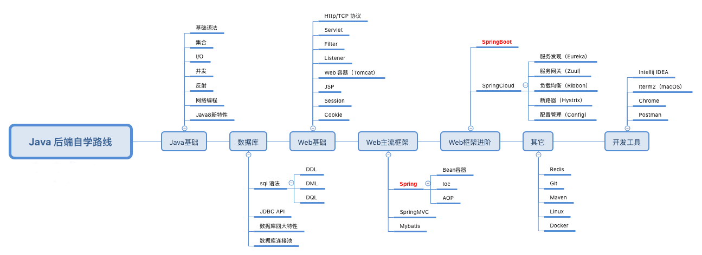

## 后端技术栈

## 整理的知识列表

大类 | 小类 | 知识链接
---|--- |---
Java基础 | [基础相关]((./basic)) |[算法](./basic/Algorithm.md)
|||[数据结构](./basic/DataStructure.md)
|||[设计模式](./basic/DesignPattern.md)
|||[I/O](./basic/IO.md)
数据库 | |[数据库](./database/DataBase.md)
web基础 |
Web主流框架 |
Web框架进阶 |
缓存相关 | [缓存](./cache) |[Redis](./cache/Redis.md)
||  |[Redis常用方法](./cache/Redis常用方法.md)
||  |[Redis持久化](./cache/Redis持久化.md)
其它 | [消息队列](./messagequeue) |[消息队列](./messagequeue/message-queue.md)
||  |[Rabbitmq](./messagequeue/rabbitmq.md)
工具|脚本|[玩转exchange（查找邮件，修改邮件，发送邮件）](https://blog.csdn.net/liuyuqin1991/article/details/86583927)|
|||[Shell 自动化编译打包](https://blog.csdn.net/liuyuqin1991/article/details/78855230)

## 天坑计划（雾）
1. 网络基础知识

